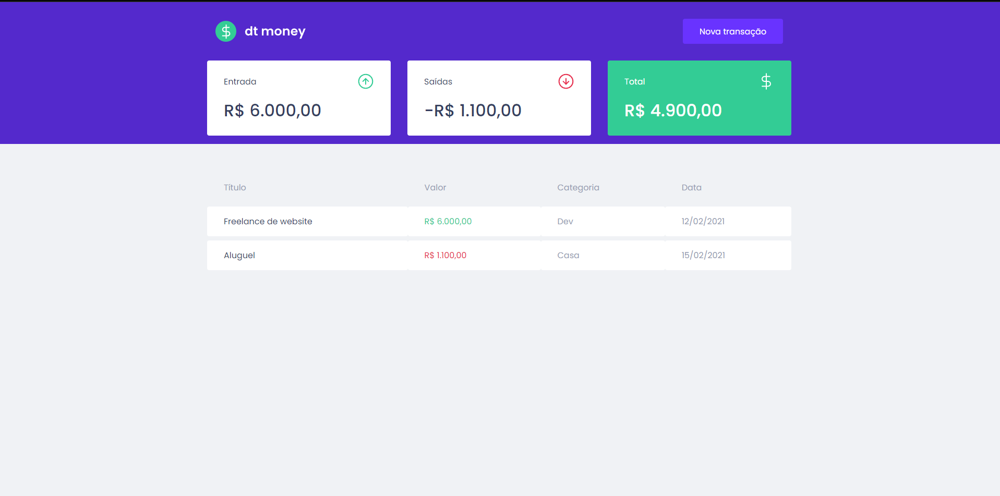

# APP dtmoney



<p align="center">“Saber exaltar as coisas lindas e boas da vida!"</blockquote>

<p align="center">
  

  <a href="https://rocketseat.com.br">
    
  </a>

  

</p>


## 💰 Aplicação para controle financeiro


Aplicação para controle financeiro.

🛠 Ferramentas usadas na aplicação.

### ° [Typescript](https://github.com/microsoft/TypeScript)
### ° [MirageJS](https://github.com/miragejs)
### ° [Styled-Components](https://github.com/styled-components)


## :zap: Executando o Projeto
#### Clonando o projeto


```sh
$ git clone https://github.com/ElvisFelix-dev/dtmoney-ReactJs.git
$ cd dtmoney-ReactJs
$ yarn
$ yarn dev
```

## :memo: Licença

Esse projeto está sob a licença MIT. Veja o arquivo [LICENSE](https://github.com/git/git-scm.com/blob/master/MIT-LICENSE.txt) para mais detalhes.

---

Feito com 💜 by <a href="https://www.linkedin.com/in/elvis-felix/">Elvis Felix</a> :wave:
